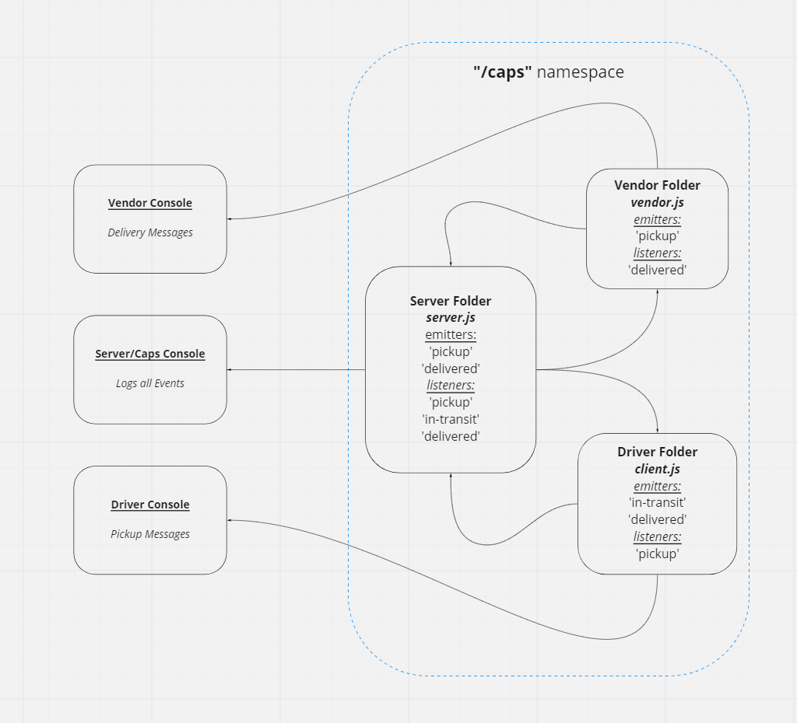
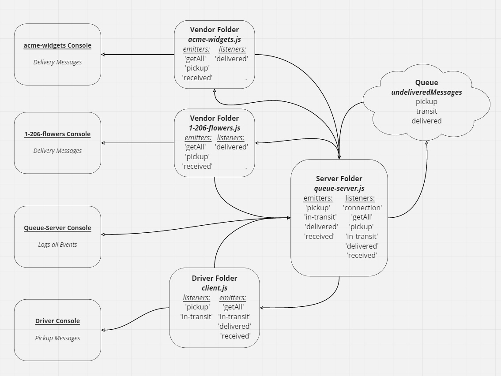

# CAPS

## Overview

#### Lab 11
Begin the build of an application for a company called CAPS - The Code Academy Parcel Service. In this sprint, we’ll build out a system that emulates a real world supply chain. CAPS will simulate a delivery service where vendors (such a flower shops) will ship products using our delivery service and when our drivers deliver them, be notified that their customers received what they purchased.

#### Lab 12
In Phase 2, we’ll be changing the underlying networking implementation of our CAPS system from using node events to using a library called `socket.io` so that we can do networked events. `Socket.io` manages the connection pool for us, makes broadcasting much easier to operate, and works well both on the terminal (between servers) and with web clients.

#### Lab 13
In this phase, we’ll be adding a layer of complexity to our application. Rather than just “fire” events and hope that our vendors and drivers respond to them, we’re going to implement a “queue” system so that nothing gets lost. Every event sent will be logged and held onto by the server until the intended recipient acknowledges that they received the message. At any time, a subscriber can get all of the messages they might have missed.

## Author: William Moreno

## Collaboration

- Carly Dekock
- James Gerstenberger
- Jason Dormier
- Jason Quaglia
- Nick Magruder

## Dependencies / Getting Started

clone the repository

run `npm install` in the terminal

In separate terminals navigate to caps directory and run the following commands in order:
1. `node /src/server/queue-server.js`
1. `node /src/driver/client.js`
1. `node /src/vendor/acme-widgets.js`
1. `node /src/vendor/1-206-flowers.js`

## Daily Pull Request

Lab 11 work was accomplished on the `events` branch. The pull request to merge the code into the `main` branch is here:

- [Pull Request](https://github.com/William-Moreno/caps/pull/1)

Lab 12 work was accomplished on the `socket.io` branch. The pull request to merge the code into the `main` branch is here:

- [Pull Request](https://github.com/William-Moreno/caps/pull/3)

Lab 13 work was accomplished on the `queue` branch. The pull request to merge the code into the `main` branch is here:

- [Pull Request](https://github.com/William-Moreno/caps/pull/5)

#### Lab 11 working features implemented:
- Created `events.js` as a global event pool
- Created `caps.js` as the main hub application
- Created `vendor.js` vendor module
- Created `driver.js` driver module

#### Lab 12 working features implemented:
- Created folders for `server`, `driver` and `vendor`
- Created `server.js` in server folder and `client.js` in driver and vendor folders
- Refactored lab 11 code into new files and implemented `socket.io` connections
- Removed files created in lab 11

#### Lab 13 working features implemented:
- Created the `undeliveredQueue` queue object with keys of `pickup`, `inTransit` and `delivered`
- Created `queue-server.js` in server folder
- Created `1-206-flowers.js` and `acme-widgets.js` in vendor folder
- Refactored lab 12 code into new files and implemented queue object and to store and deliver unreceived messages/events to vendors (delivered) and driver (pickup and in-transit)

## Tests

#### Lab 11
Test suite generated to test event handlers:

  - All tests successfully passed.

#### Lab 12
Removed previous obsolete test suite

  - No tests required for lab 12

#### Lab 13
Tested server and clients commuication and message queue functionality manually by stopping and starting different vendors and the driver programs at differing times.

App performs as required and expected.

## UML

UML drawings created with [miro](https://miro.com/)

### Lab 11
---

### Lab 12
---

### Lab 13
---
