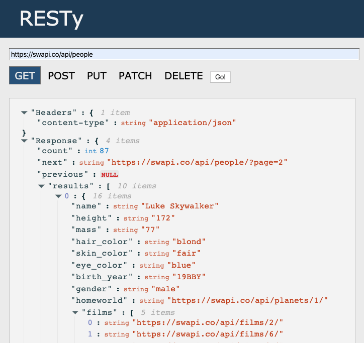

# LAB - Props and State

**RESTy Phase 2:** Connect RESTy with APIs, running live requests

## Before you begin

Refer to *Getting Started*  in the [lab submission instructions](../../../reference/submission-instructions/labs/README.md) for complete setup, configuration, deployment, and submission instructions.

> Continue working in your 'resty' repository, in a branch called 'props-and-state'

## Business Requirements

Refer to the [RESTy System Overview](../../apps-and-libraries/resty/README.md) for a complete review of the application, including Business and Technical requirements along with the development roadmap.

## Phase 2 Requirements

In phase 2, we will be connecting RESTy to live APIs, fetching and displaying remote data. Our primary focus will be to service *GET* requests

The following user stories detail the major functionality for this phase of the project.

- As a user, I want to enter the URL to an API and issue a GET request so that I can retrieve it's data
- As a user, I want to see the results returned from an API request in my browser in a readable format

Application Flow:

- User enters an API URL
- Chooses a REST Method
- Clicks the  "Go" button
- Application fetches data from the URL given, with the method specified
- Displays the response headers and results separately
- Both headers and results should be "pretty printed" JSON

> One possible design/layout. Please use your judgement and taste in styling your version of this application.

## Technical Requirements / Note

Suggested Component Hierarchy and Application Architecture:

- `index.js` - Entry Point
- `app.js` - Container
  - Holds state: Count and Results Array
  - A class method that can update state
  - Renders 2 Child Components
- `<Form />`
  - Expects a function to be sent to it as a prop
  - Renders a URL entry form
  - A selection of REST methods to choose from ("get" should be the default)
  - On submit
    - Send the API results back to the `<App>` using the method sent down in props
- `<Results />`
  - Expects the count, headers, results to be sent in as props
  - Renders the count
  - Renders the Result Headers as "pretty" JSON
  - Renders the Result Body as "pretty" JSON

## Tests

- Install the React Testing Library framework
- Assert that upon submitting the form will result in data being rendered in the output area

## Deployment

Deploy your application to GitHub pages using a GitHub action which will publish the "build" to the `gh-pages` branch of your repository on all check-ins

## Stretch Goals

Add support for all REST methods

- **GET** a single record by ID
- **DELETE** a single record by ID
- **PUT** a single record by ID
  - Requires the addition of a text area where you can type in the JSON body for the update
- **POST** to create a new record
  - Requires the addition of a text area where you can type in the JSON body for the new record

## Assignment Submission Instructions

Refer to the the [Submitting React Apps Lab Submission Instructions](../../../reference/submission-instructions/labs/react-apps.md) for the complete lab submission process and expectations
