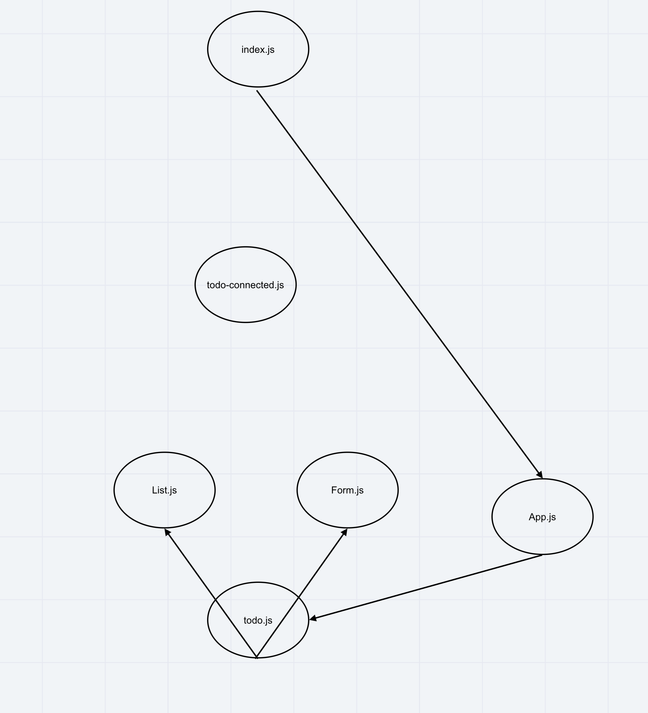

# LAB - Context API

## Author: Jason Quaglia

[Link to PR](https://github.com/jquaglia/todo/pull/5)

[Link to Deployed App](https://vigorous-poitras-0340ff.netlify.app/)

## todo Phase 1:

Today, we begin the first of a 4-phase build of the To Do List Manager, a web-based task manager application, written in React. In this first phase, our goal is to setup a foundational system using React hooks that we can build upon in later phases, adding databases, logins, and more advanced features.

The following user/developer stories detail the major functionality for this phase of the project.

- As a user, I would like an easy way to add a new to do item using an online interface

- As a user, I would like my to do items to have an assignee, due date, difficulty meter, status and the task itself

- As a user, I would like to delete to do items that are no longer needed

- As a user, I would like to easily mark to do items as completed

- As a user, I would like to edit an existing to do item

## todo Phase 2:

In Phase 2, we’re going to connect the To Do Manager to a deployed API, backed by a database. The core functionality and stories do not change (reference Phase 1), but a new one has been added to note this shift in persistence.

- As a user, I would like to be able to add, update, and delete To Do items

- As a user, I would like my To Do Items to be permanently stored so that I can re-access them at any time, using any device

Note that the display of each To Do item has changed slightly.

## todo Phase 3:

In Phase 3, we’d like to extend the functionality of the application by potentially allowing users to set a few configuration options to change how the application behaves. The user stories from Phases 1 and 2 remain unchanged. For this phase, we are now adding the following new user stories.

- As a user, I would like to see my To Do List Items a few at a time so that I don’t have to wade through them all

- As a user, I would like my default view to only be “Incomplete” Items so that I can quickly determine what I have to do.

- As a user, I would like my list sorted by difficulty so that I can more easily prioritize

- As a user, I would like the option to change my default preferences with regards to how many Items I see per page, which items are filtered, and how they are sorted

## Collaborators

- Jason Dormier

- Carly Dekock

- Seid Mohamed

- Nick Magruder

- Bill Moreno

## Resources

- [Bootstrap guide](https://react-bootstrap.github.io/components/alerts/)

UML

## Getting Started with Create React App

This project was bootstrapped with [Create React App](https://github.com/facebook/create-react-app).

## Available Scripts

In the project directory, you can run:

### `npm start`

Runs the app in the development mode.\
Open [http://localhost:3000](http://localhost:3000) to view it in the browser.

The page will reload if you make edits.\
You will also see any lint errors in the console.

### `npm test`

Launches the test runner in the interactive watch mode.\
See the section about [running tests](https://facebook.github.io/create-react-app/docs/running-tests) for more information.

### `npm run build`

Builds the app for production to the `build` folder.\
It correctly bundles React in production mode and optimizes the build for the best performance.

The build is minified and the filenames include the hashes.\
Your app is ready to be deployed!

See the section about [deployment](https://facebook.github.io/create-react-app/docs/deployment) for more information.

### `npm run eject`

**Note: this is a one-way operation. Once you `eject`, you can’t go back!**

If you aren’t satisfied with the build tool and configuration choices, you can `eject` at any time. This command will remove the single build dependency from your project.

Instead, it will copy all the configuration files and the transitive dependencies (webpack, Babel, ESLint, etc) right into your project so you have full control over them. All of the commands except `eject` will still work, but they will point to the copied scripts so you can tweak them. At this point you’re on your own.

You don’t have to ever use `eject`. The curated feature set is suitable for small and middle deployments, and you shouldn’t feel obligated to use this feature. However we understand that this tool wouldn’t be useful if you couldn’t customize it when you are ready for it.

## Learn More

You can learn more in the [Create React App documentation](https://facebook.github.io/create-react-app/docs/getting-started).

To learn React, check out the [React documentation](https://reactjs.org/).

### Code Splitting

This section has moved here: [https://facebook.github.io/create-react-app/docs/code-splitting](https://facebook.github.io/create-react-app/docs/code-splitting)

### Analyzing the Bundle Size

This section has moved here: [https://facebook.github.io/create-react-app/docs/analyzing-the-bundle-size](https://facebook.github.io/create-react-app/docs/analyzing-the-bundle-size)

### Making a Progressive Web App

This section has moved here: [https://facebook.github.io/create-react-app/docs/making-a-progressive-web-app](https://facebook.github.io/create-react-app/docs/making-a-progressive-web-app)

### Advanced Configuration

This section has moved here: [https://facebook.github.io/create-react-app/docs/advanced-configuration](https://facebook.github.io/create-react-app/docs/advanced-configuration)

### Deployment

This section has moved here: [https://facebook.github.io/create-react-app/docs/deployment](https://facebook.github.io/create-react-app/docs/deployment)

### `npm run build` fails to minify

This section has moved here: [https://facebook.github.io/create-react-app/docs/troubleshooting#npm-run-build-fails-to-minify](https://facebook.github.io/create-react-app/docs/troubleshooting#npm-run-build-fails-to-minify)
