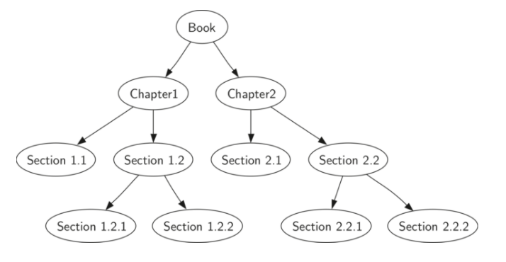

# Warm Up - Searching for Paragraphs in a Book

Books are great to use a a tool for organizing content in a heirarchical way.  This exercies will test your knowledge of trees using Books as an abstraction of Tree behavior.  

## Overview

Books and documents are often organized by a heirarchy of terms.  A `Book` is often made up of `Chapters` each chapter is often composed of `Sections` and those are ofen made up of a number of `Paragraphs`.  You are given a system for managing the parts of a `Book`, each will manage their own children:



> the above tree shows a book  organized by numerical section and sub-section.

* You are given a javascript library that can manage a book which is made up of chapters => sections => paragraphs in that order.  The library contains these methods to manage it's contents:
  * addChapter:  creates a new `Chapter` for the book.
  * addSection:  creates a new `Section` provided the chapter index and a heading.
  * addParagraph: create a new `Paragraph` provided the chapter and section index in dot notation.

### Challenge

* Your job is to [create a function](./src/lib/Book.js) that can search through the sub layers of a `Book` and return the `paragraph` specified by the indexing system: `1.1.1` corresponds to chapter 1, section 1, paragraph 1.
* When you are finished try running `npm test` to execute your function against the test suite.

## Sample Inputs and Outputs

```javascript

let myOpus = new Book('The Great Jacobsby', 100); // creates a book with 100 chapters


myOpus.addChapter('From The Beginning');
myOpus.addSection('1', 'The very beginning');
myOpus.addParagraph('1.1', 'Ive run out of words to say');

myOpus.findParagraph('1.1.1') // 'Ive run out of words to say'

```
