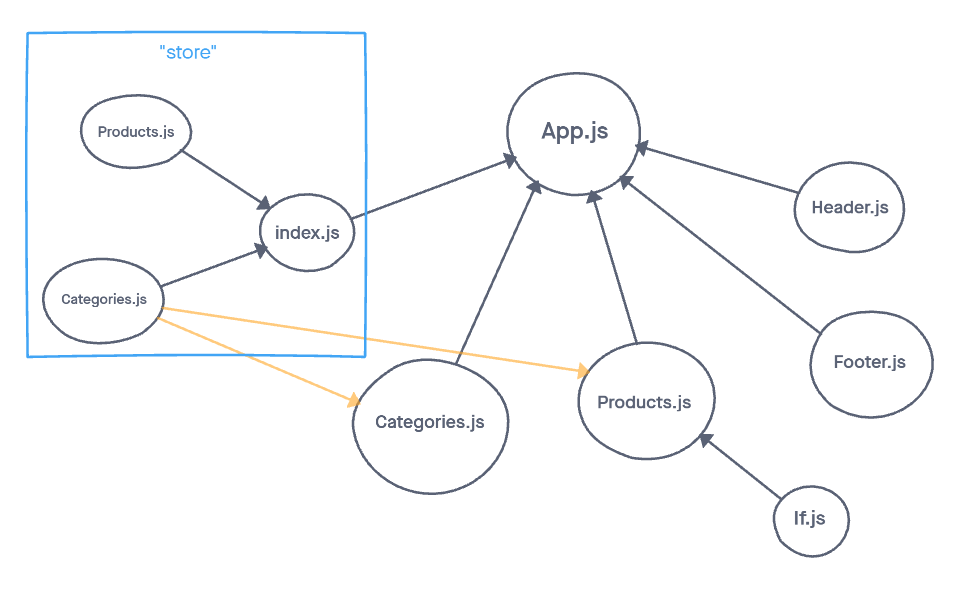
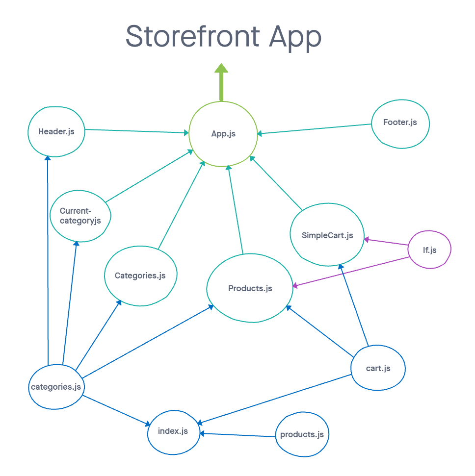

# Virtual Store

### Lab 36
Virtual Store Phase 1: For this assignment, you will be starting the process of creating an e-Commerce storefront using React with Redux, coupled with your live API server

### Lab 37
Virtual Store Phase 2: Continue work on the e-Commerce storefront, breaking up the store into multiple reducers and sharing functionality/data between components

## Overview

### Lab 36
Today, we begin the first of a 4-Phase build of the storefront application, written in React. In this first phase, our goal is to setup the basic scaffolding of the application with initial styling and basic behaviors. This initial build sets up the file structure and state management so that we can progressively build this application in a scalable manner

### Lab 37
In phase 2, we will be adding the “Add to Cart” feature to our application, which will allow our users to not only browse items in the store, but also select them and have them persist in their “shopping cart” for later purchase.

## Author: William Moreno

## Getting Started

The Virtual Store can be found here on Netlify:

[Virtual Store](https://hardcore-wright-bd2382.netlify.app/)

## Features

### Lab 36
- an `App` component that serves as the container for all sub-components of this application
- a <Header> component which shows the name of your virtual store
- a <Footer> component which shows your copyright and contact information
- a <Categories> component
  - shows a list of all categories
  - dispatches an action when one is clicked to “activate” it
- a <Products> component
  - displays a list of products associated with the selected category

### Lab 37
- Add a new component to the page: <SimpleCart />
  - Displays a short list (title only) of products in the cart
  - This should be present at all times
- Home Page Operation:
  - When the user selects (clicks on) a category …
    - Identify that category as selected
    - Show a list of products associated with the category, that have a quantity > 0
    - Add an “add to cart” button to each product
  = When a user clicks the “add to cart” button add the item to their cart
    - In the <SimpleCart/> component, show a running list of the items in the cart (just the titles)
    - Change the (0) indicator in the header to show the actual number of items in the cart
    - Reduce the number in stock for that product

## Process

### Lab 36
Repository created. Create-react-app used to create project folder. Folder loaded into repository. Basic scaffolding of project folder and installation of required dependencies. Basic Header and Footer created and attached. Redux store created (categories and index) and connected to app. Categories component created and integrated. Store expanded to include products.js and Products.js component created. If.js created as a helper and installed. All components then styled utilizing '@material-ui'.

App deployed on Netlify.

### Lab 37
Added cart.js to store. Created a reducer and actions for the cart to facilitate adding and removing products. Piggy-backed off of the same actions to regulate levels of inventory in the products store. Added functionality to prevent products with no current inventory from showing on the products page. Separated the cuurent-category into its own rendering component. Added a shopping cart count to the right side of the head that keeps a running tally of the amount of items in the cart. Added the SimpleCart component to the page which is always visible and renders all products in the cart. Styled all of the new elements using material-ui.

App redeployed on Netlify.

## UML

UML drawing created with [miro](https://miro.com/)

### Lab 36

### Lab 37

