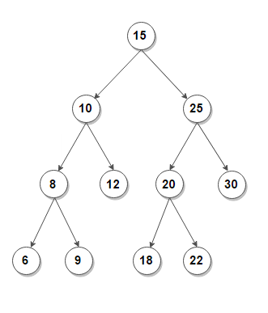

# Warm Up - Find a Pair with a given Sum in a Binary Search Tree

Given a Binary Search Tree and an Integer, find a pair of values that sum to the provided Integer.

## Overview

Binary Search Tree are great for storing values that are sorted, so they can be searched later.  Traverse a BST and return the first pair that matches the `sum`.

Once the algorithm is completed, provide a way to validate that your solution works.

### Sample Inputs and Outputs

### Input

  

  Sum: 32

### Output

  (10, 22)
